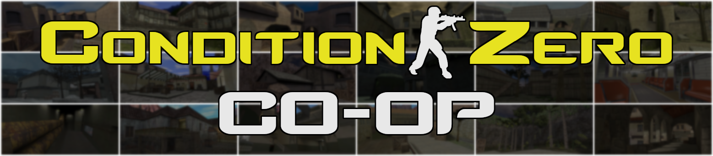

# Counter-Strike: Condition Zero Cooperative Patch

Cooperative patches for **Counter-Strike: Condition Zero**. Enables cooperative play for **Tour of Duty** missions and allows to play with **Yet Another POD-Bots**.

https://github.com/MuxaJlbl4/Condition-Zero-Coop/assets/20092823/f141a596-781c-4f08-8b7b-f7462a6a2d7a

- Left side: **Admin** `192.168.124.1`
- Right side: **Player** `192.168.124.160`
- Added extra enemy bots on Player join

## Features
- 🏃‍♀️ Compatibility with [Yet Another POD-Bot (YaPB)](https://yapb.readthedocs.io/en/latest/index.html)
- 🎮 Maximum slots and spawns for extra players
- 😎 Singleplayer and custom campaign support
- ➕ Extra bots addition for each joined player
- 🍰 Simplified survival and in-a-row tasks
- 🎫 Fixed restart and continue messages
- 🧊 Decreased freeze time
- 🔦 Enabled flashlights
- 🗝️ No passwords
- ⏳ No pauses

## Requirements
- [Counter-Strike: Condition Zero](https://store.steampowered.com/app/80) for all teammates
- **LAN connection** with your teammates (physical or VPN)

## Installation and Usage
- **Admin**: Install [Condition-Zero-Coop.exe](https://github.com/MuxaJlbl4/Condition-Zero-Coop/releases/latest) to your **Half-Life** folder and start any career mission
- **Teammates**: Connect to Admin by `connect <IP>` or `Find Servers -> Lan`

## CVars
All settings should be configured via [coop.cfg](czero/coop.cfg) file:

### Variables
| CVar | Default Value | Description |
| ---- | :-----------: | ----------- |
| `bots_custom_ai` | 0 | Custom bots AI: **1** - **YaPB**; **0** - **zBot** (default AI) |
| `bots_per_player` | 3 | Extra bots on player join Adds the specified number of enemy bots with campaign difficulty skill |
| `motd_restart` | 1 | Show MotD on mission restart: **1** - **on**; **0** - **off** |
| `simple_hostages` | 1 | Hostage tasks can be completed by: **1** - **players & YaPB** bots; **0** - **players** only |
| `simple_survival` | 1 | Simplified survival and in-a-row tasks. Task fails when: **1** - **all** players are dead; **0** - **any** player is dead |

### Auxiliary
| CVar | Description |
| ---- | ----------- |
| `bot_difficulty` | Extra bots and YaPB difficulty: **0** - **Easy/Newbie**; **1** - **Medium/Average**; **2** - **Hard/Normal**; **3** - **Expert/Professional**; **4** - **Expert/Godlike (YaPB)** |
| `mp_friendlyfire` | Allow friendly fire: **1** - **on**; **0** - **off** |

### Commands
| Command | Description |
| ------- | ----------- |
| `map_info` | Show map name and spawn count |
| `player_kill` | Kill all players (non-bots) |

## Notes
- 🪟 Compatible with Windows Steam [25th Anniversary Update](https://half-life.com/en/halflife25) version
- ⏳ Latest compatible version for **Beta-SteamPipe** and **Pre-25th** builds - [1.3.0](https://github.com/MuxaJlbl4/Condition-Zero-Coop/releases/tag/1.3.0)
- 🍌 More missions: [gamebanana.com](https://gamebanana.com/mods/cats/2547?_sSort=Generic_MostLiked)
- 🟣 Steam guides: [Eng](https://steamcommunity.com/sharedfiles/filedetails/?id=3059078485); [Rus](https://steamcommunity.com/sharedfiles/filedetails/?id=3059084601)

## Limitations
- 🔄 Mission change requires teammates reconnection
- 👀 Teammates can't view tasks
- 👯‍♀ Max players = 32

## Building
1. Install:
	- [Counter-Strike: Condition Zero](https://store.steampowered.com/app/80) - Clean **Base** Steam version
	- [ReGameDLL_CS](https://github.com/s1lentq/ReGameDLL_CS/actions) - [**Release Play** version*](# "Actions -> Run -> Artifacts -> win32 -> tests -> mp.dll
or build Release Play manually with Visual Studio 2015 Update 3")
	- [AMX Mod X](https://www.amxmodx.org/downloads-new.php?branch=master) - Base Package + Counter-Strike
	- [Metamod-R](https://github.com/theAsmodai/metamod-r/releases/latest)
	- [Orpheu](https://github.com/Arkshine/Orpheu/releases/latest)
	- [ReAPI](https://github.com/s1lentq/reapi/releases/latest)
	- [YaPB](https://github.com/yapb/yapb/releases/latest)
2. Copy (with replace) repository content to your `Half-Life` folder
3. Replace hex bytes `3B F0 0F 4C F0 A1` to `BE 20 00 00 00 A1` in your `Half-Life\hw.dll` file
4. Launch `Half-Life\czero\addons\amxmodx\scripting\autospawnpoints.bat` to compile [Autospawnpoints](https://dev-cs.ru/resources/1253) plugin
5. Launch `Half-Life\czero\addons\amxmodx\scripting\cz_coop.bat` to compile [Condition Zero Coop](czero/addons/amxmodx/scripting/cz_coop.sma) plugin
6. Compile `Half-Life\Condition-Zero-Coop.iss` with [Inno Setup](https://jrsoftware.org/isinfo.php) to make installer

## Special Thanks
[Arkshine](https://github.com/Arkshine) · [dystopm](https://github.com/dystopm) · [fl0werD](https://github.com/fl0werD) · [iPlague](https://roadtoglory.ru/profile?id=1) · [jeefo](https://github.com/jeefo) · [jkivilin](https://github.com/jkivilin) · [LunaTheReborn](https://forums.alliedmods.net/member.php?u=297878) · [s1lentq](https://github.com/s1lentq) · [theAsmodai](https://github.com/theAsmodai) · [Vaqtincha](https://github.com/Vaqtincha) · [wopox1337](https://github.com/wopox1337)
